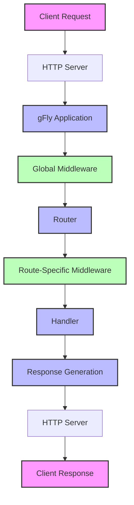
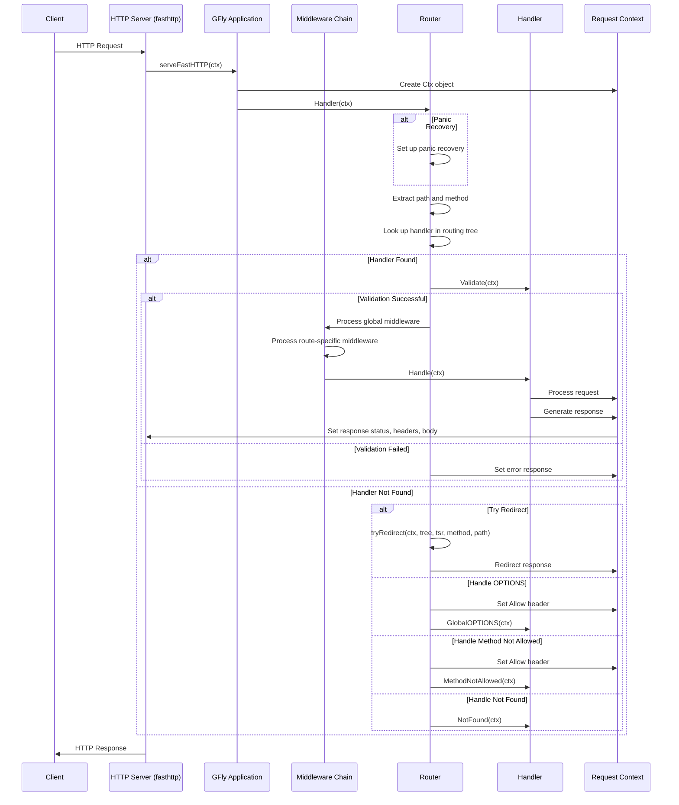
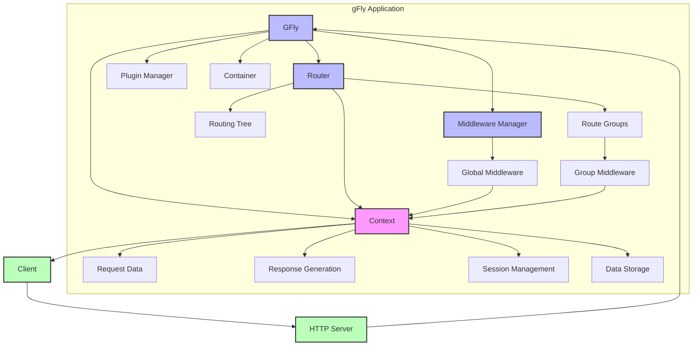

# gFly Request Lifecycle

This document explains the lifecycle of a request in the gFly framework, from the moment it is received until the response is sent back to the client. Understanding this lifecycle is essential for developing applications with gFly and for troubleshooting issues.

## Overview

The gFly framework processes HTTP requests through several stages, involving different components that work together to handle the request and generate a response. The following diagrams illustrate this process.

## High-Level Overview

The diagram above shows the high-level flow of a request through the gFly framework:

1. A client sends an HTTP request to the server.
2. The HTTP server (based on fasthttp) receives the request.
3. The request is passed to the gFly application.
4. Global middleware processes the request.
5. The router matches the request to a route.
6. Route-specific middleware processes the request.
7. The matched handler processes the request.
8. The handler generates a response.
9. The response is sent back to the client through the HTTP server.

## Detailed Sequence Diagram

This sequence diagram provides a more detailed view of the request lifecycle:

1. The client sends an HTTP request to the server.
2. The server passes the request to the gFly application's `serveFastHTTP` method.
3. The gFly application creates a new `Ctx` object to encapsulate the request and response.
4. The request is passed to the router's `Handler` method.
5. The router sets up panic recovery if a panic handler is configured.
6. The router extracts the path and method from the request.
7. The router looks up the appropriate handler in the routing tree.
8. If a handler is found:
   - The handler's `Validate` method is called to validate the request.
   - If validation is successful, the request is processed through the middleware chain and then by the handler.
   - If validation fails, an error response is generated.
9. If no handler is found:
   - The router tries to redirect the request if appropriate.
   - If the request is an OPTIONS request, the router sets the Allow header and calls the GlobalOPTIONS handler.
   - If the method is not allowed, the router sets the Allow header and calls the MethodNotAllowed handler.
   - If the route is not found, the router calls the NotFound handler.
10. The response is sent back to the client.

## Component Interaction Diagram

This component interaction diagram shows how the different components of the gFly framework interact during request processing:

1. The GFly application is the central component that coordinates all others.
2. The Router is responsible for matching requests to handlers.
3. The Middleware Manager manages global and group-specific middleware.
4. The Plugin Manager manages plugins that can extend the framework's functionality.
5. The Container provides dependency injection for services.
6. The Context is the interface between the application and the request/response, providing:
   - Access to request data (form values, query parameters, path parameters, etc.)
   - Methods for generating responses (JSON, HTML, files, etc.)
   - Session management
   - Data storage for the request lifecycle

## Key Points in the Request Lifecycle

1. **Request Reception**: The HTTP server receives the request and passes it to the gFly application.
2. **Context Creation**: The gFly application creates a new Context object to encapsulate the request and response.
3. **Routing**: The router matches the request to a route based on the HTTP method and path.
4. **Middleware Processing**: Global and route-specific middleware process the request before it reaches the handler.
5. **Handler Execution**: The matched handler processes the request and generates a response.
6. **Response Generation**: The response is generated and sent back to the client.
7. **Error Handling**: Errors are handled at various points in the lifecycle, with appropriate responses generated.
8. **Panic Recovery**: Panics are recovered and handled gracefully to prevent the application from crashing.

## Conclusion

Understanding the request lifecycle in the gFly framework is essential for developing applications and troubleshooting issues. The diagrams and explanations in this document provide a comprehensive overview of how requests are processed, from reception to response.